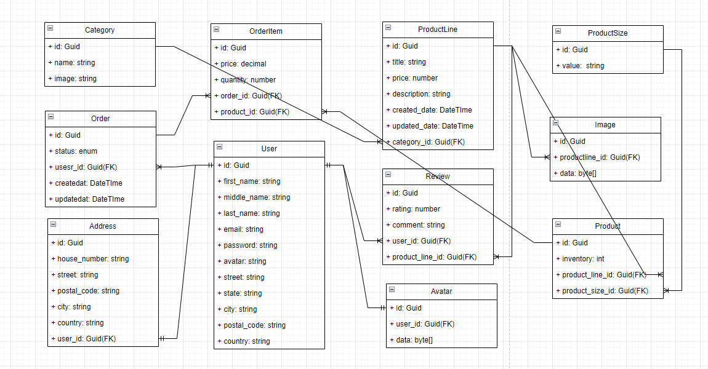
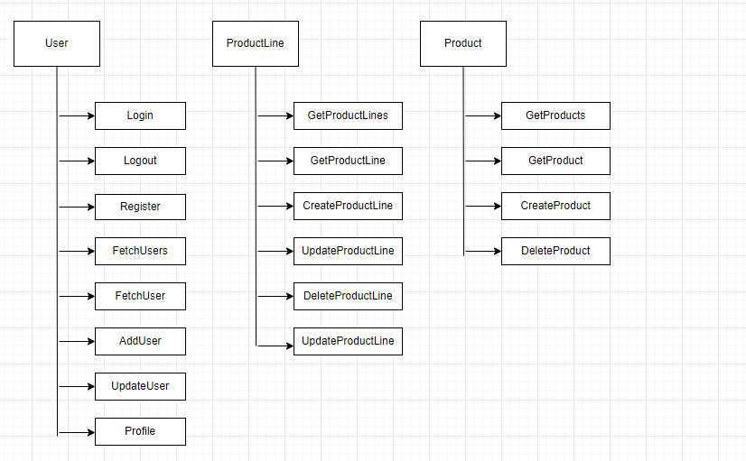
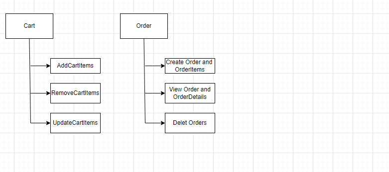

# Fullstack Project
## Introduction
This is an Ecommerce application design and deployed as a final assignment in Integrify academy. It is built using react in frontend, DotNet core in backend and postgres as database. The primary objective of this project is to develop a software application that support CRUD operation, authentication and authorization using the best practices. 

## Table of Contents

1. [Technologies](#technologies)
2. [File Structure](#filestructure)
3. [Application Module Overview](#overview)
4. [Features](#features)
5. [Functionalities by ROle](#functionalities)
6. [Requirements](#requirements)
7. [Getting Started](#getting-started)
8. [DeploymentLink](#deployment)
9. [Testing](#testing)

## Technologies

   ### Frontend

      * Typescript
      * React
      * Redux (Toolkit)
      * React Router
      * Material UI

   ### Backend

      * DotNet Core
      * Entity Framework
      * Postgres

## File Structure
- ECOMMERCE
  - Ecommerce.Business
  - Ecommerce.Controller
  - Ecommerce.Core
  - Ecommerce.HttpTest
  - Ecommerce.Test
  - Ecommerce.WebAPI
  - Ecommerce.sln
  - README.md

## Architecture

   This project is developed following clean architecture. It ensures system is more scalable for future enhancement and maintainability. It consist of
   * WebAPI Layer
   * Controller Layer
   * Business Layer
   * Core Layer

## ERD Diagram
   

## Application Module Overview
 
   Functionalities available for each module is illustrated in the following diagrams

   

   

## Features

   * Create, View, edit and delete Products.
   * Create, View, edit and delete Product Lines.
   * Manage user and roles.
   * Authenticate and Authorize user
   * Create Orders and OrderItems.
   * Manage Reviews.

## Functionalities by Role

   This application has 2 level role for system privelege. Their privelege levels are as follows
   1. Admin
      * Create,Delete,Update and Retrieve Product Lines
      * Create,Delete and Retrieve Products
      * Create,Delete,Update and Retrieve Categories
      * Create,Delete,Update and Retrieve Orders
      * Retrieve Reviews(API only)
      * Create,Delete,Update and Retrieve Users

   2. Customer
      * Retrieve Product Lines
      * Retrieve Products
      * Retrieve Categories
      * Create Orders
      * Create and Retrieve Reviews(API only)
      * Create and GetProfile of current User

## Getting Started

   ### Frontend Setup

      To start the project first clone the project from the repository and run the node commands.

      1. git clone https://github.com/sunilkarki2018/EcommerceApp.git
      2 . cd fs16_6-frontend-project
      3. git checkout develop
      4. npm install
      5. npm start

   ### Backend Setup

      To start the project first clone the project from the repository and install DotNet SDK 8.

      1. git clone https://github.com/sunilkarki2018/fs16_CSharp-FullStack
      2. git checkout develop
      3. cd Ecommerce.WebApi
      4. DotNet run

   ### Database Setup
    
    To setup fresh database run following commands

    1. dotnet ef migrations add InitialMigration
    2. dotnet ef database update
    3. dotnet ef database drop (if needed)

## Deplyoment Link

   ## Application Link
   https://bucolic-semifreddo-2378d4.netlify.app/

   Admin Credentials
   Username: admin@mail.com
   Password: admin123

   Customer Crendentials
   User: customer@mail.com
   Password: customer123

   ## Swagger Link
   https://ecommerce2024v1.azurewebsites.net/swagger/index.html

## Testing

To run test: dotnet test

